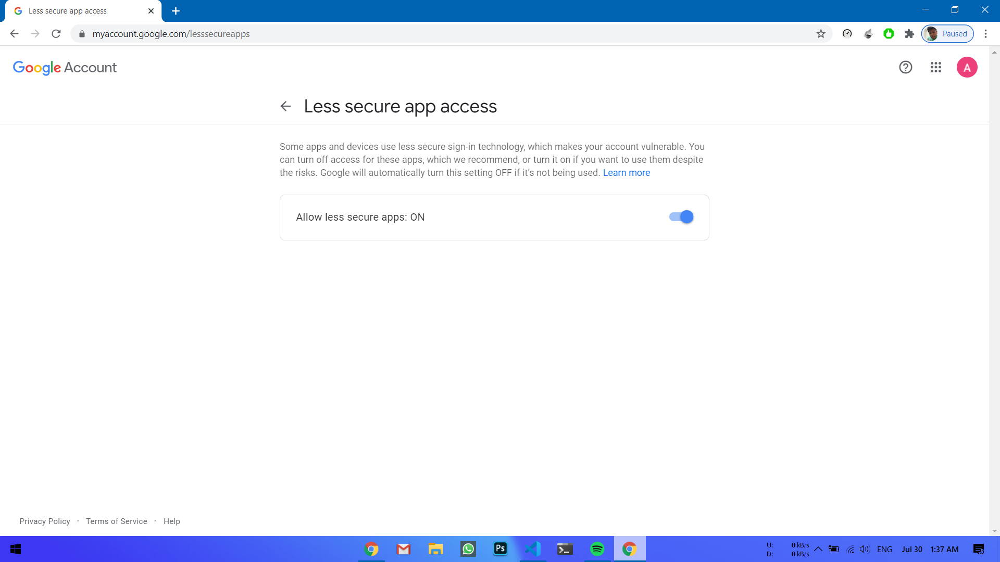

# Contributing to Eco Commerce
We love your input! We want to make contributing to this project as easy and transparent as possible, whether it's:

- Reporting a bug
- Discussing the current state of the code
- Submitting a fix
- Proposing new features
- Becoming a maintainer

## We Develop with Github
We use github to host code, to track issues and feature requests, as well as accept pull requests.

## We Use [Github Flow](https://guides.github.com/introduction/flow/index.html), So All Code Changes Happen Through Pull Requests
Pull requests are the best way to propose changes to the codebase (we use [Github Flow](https://guides.github.com/introduction/flow/index.html)). We actively welcome your pull requests:

1. Fork the repo and create your branch from `master`.
2. You need to create a file called smtpKey.dart with the following syntax that stores the username and password for the email account from which you want to send the user verfication and other emails.
```
const String username = 'username';
const String password = 'password';
```
Whatever account you use make sure to turn the less secure app access on, as it is required by the mailing service to work.

3. You also need to create a Firebase project, download the google-services.json to `android/app/` directory.
If you need to create your own products you can follow the schema below in your MongoDB or other NoSQL backend.
```
.
├── categories
|   └── category
|       ├── name - 'category_name'
|       └── products - Relational many to many link
├── products
|   └── product
|       ├── price - Product Price (Number)
|       ├── name - 'Product Name'
|       ├── features - 'Product Features'
|       ├── desc - 'Product Description'
|       ├── images - Product Images (Media)
|       ├── rating - Number
|       ├── discount - Number
|       ├── seller_name - 'Seller's Name'
|       ├── tags - 'Tags separated by commas'
|       ├── reviews - JSON structure
|       ├── categoryies - Relational many to many link
|       └── users - Relational many to many link
|
└── users
    └── user
        ├── username - 'User Name'
        ├── email - 'User email'
        ├── password - Password
        ├── confirmed - boolean
        ├── blocked - boolean
        ├── organisation - 'Organisation Name'
        ├── orgemail - 'Organisation email'
        ├── phone - 'Phone number'
        └── products - Relational many to many link
```
4. If you've added code that should be tested, add tests.
5. If you've changed APIs, update the documentation.
6. Ensure the test suite passes.
7. Make sure your code lints.
8. Issue that pull request!

## Any contributions you make will be under the BSD-3 Software License
In short, when you submit code changes, your submissions are understood to be under the same [BSD-3 License](https://choosealicense.com/licenses/bsd-3-clause/) that covers the project. Feel free to contact the maintainers if that's a concern.

## Report bugs using Github's [issues](https://github.com/Hash-Studios/eco_commerce_app/issues)
We use GitHub issues to track public bugs. Report a bug by [opening a new issue](https://github.com/Hash-Studios/eco_commerce_app/issues/new); it's that easy!

## Write bug reports with detail, background, and sample code
**Great Bug Reports** tend to have:

- A quick summary and/or background
- Steps to reproduce
  - Be specific!
  - Give sample code if you can.
- What you expected would happen
- What actually happens
- Notes (possibly including why you think this might be happening, or stuff you tried that didn't work)

People *love* thorough bug reports. We're not even kidding.

## Use a Consistent Coding Style
* Use DART formatter

## License
By contributing, you agree that your contributions will be licensed under its BSD-3 License.
